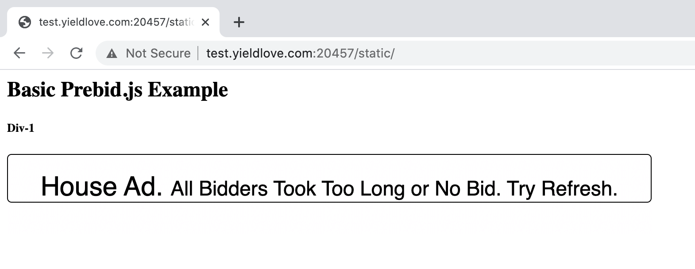
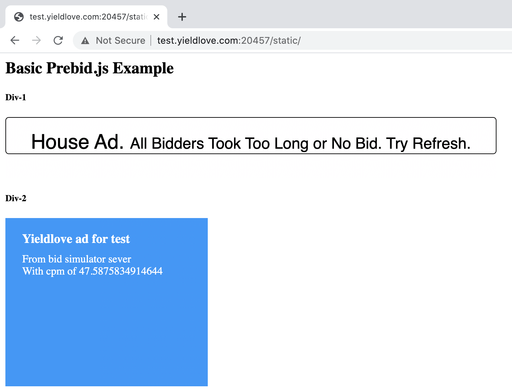

# Code Challenges

- [Code Challenges](#code-challenges)
  * [Goal](#goal)
  * [Challenges](#challenges)
    + [Challenge A](#challenge-a)
    + [Challenge B](#challenge-b)
      - [Endpoint](#endpoint)
      - [Prebid.js Build](#prebidjs-build)
      - [Yieldlove bid adapter](#yieldlove-bid-adapter)
    + [Challenge C](#challenge-c)
    + [Challenge D](#challenge-d)
    + [Challenge E](#challenge-e)
- [References](#references)
    + [What is header bidding?](#what-is-header-bidding)
    + [Basic Prebid.js Example with googletag integration](#basic-prebidjs-example-with-googletag-integration)
    + [Ad Unit Reference](#ad-unit-reference)
    + [Google Tag API Reference](#google-tag-api-reference)
    + [Building Prebid.js locally for tests](#building-prebidjs-locally-for-tests)


## Goal

Read/learn documents in the references section about header bidding. 

Implement the following challenges **as best as you can**.

Please keep your codes and environments. It would be nice to review your pages and codes in the interview.


## Challenges


### Challenge A

Implement a html page to display **an ad** with Prebid.js and googletag integrated based on the **'Basic Prebid.js Example'** from Prebid.js.

The size of the ad should be with the width of 728 and the height of 90

Here is the expected output:




### Challenge B

On top of the challenge A, implement another ad in 'div-2', the ad should be delivered from the provided bid server simulator.

Here are the information to establish the  bid server simulator by Node.js:


#### Endpoint

The entry of the bid server is located at `./bid-server/server.js`. It exposes two endpoints:

| Endpoint       | Description |
| -------------- | ----------- |
| `/static` | To make static html pages assessable via the bid server |
| `/bids` | To receive bids requests from the yieldloveBidAdapter in Prebid.js and response bids |

It is required to map [test.yieldlove.com:20457](http://test.yieldlove.com:20457) to your localhost.
The endpoints must be accessible via the domain [test.yieldlove.com:20457](http://test.yieldlove.com:20457),
This can be accomplished by modifying your hosts file.


#### Prebid.js Build

A local built Prebid.js with the provided `yieldloveBidAdapter.js` under the `resources` folder is needed.

Build Prebid.js locally and use the built Prebid.js to display ads.
Please refer to "Build Prebid.js locally for tests" in the References section for more information.


#### Yieldlove bid adapter

Enable the Yieldlove bid adapter at the local build.

The provided `yieldloveBidAdapter.js` needs to be placed into the `modules` folder.

The `window.pbjsYLHH` must refer to `pbjs` before calling `pbjs.requestBids`.
The html page to display ads should be accessible via the [test.yieldlove.com:20457/static](http://test.yieldlove.com:20457/static)
The ad unit code (ad unit path) displayed in the 'div-2' should be `/53015287/yieldlove.com_hb_test_300x250_2`

Here is the bids configuration:

```
[
  {
    bidder: 'yieldlove',
    params: {
      placementId: 40882157810
    }
  }
]
```

The size should be with the width of 300 and the height of 250

It's recommended to turn on Prebid.js debug messages on console to debug. Check more details here:
https://docs.prebid.org/troubleshooting/troubleshooting-guide.html#turn-on-prebidjs-debug-messages


The expected solution should look similar to the following image:



The cpm in the responded bid is generated randomly.


### Challenge C

Based on **Challange B**. Set a customized targeting key for the GPT slot for `/53015287/yieldlove.com_hb_test_300x250_2` based on received bids.

Call `googletag.Slot.setTargeting` to set targeting keys for a specified ad slot.

Refer to the Google Tag API for more inforamtion. The `Slot.setTargeting` must be called before invoking `googletag.pubads().refresh()`

| Key            | Value | Description |
| -------------- | ----- | ----------- |
| `yieldlove_hb_pb` | A rounded number with two decimal places from the CPM of the winning bid | The rule to round is:<br> - if the CPM < 20, rounded to 2 decimal<br> - if the CPM ≥ 20 and < 60, rounded to 2 decimal with step of each 0.05 euro<br><br>For Example:<br>- If the CPM is 0.5213124, the value should be `0.52`<br> - If the CPM is 21.21456, the value should be `21.25`<br> - If the CPM is 22.266, the value should be `22.30` |
| `yieldlove_hb_adid` | The ad identifier of the received bid | The `bidResponse.adId` property |
| `yieldlove_hb_placement` | The placement identifier | A constant value of `9859` |


### Challenge D

Implement the ad of **Challenge B - "Div-2"** with Prebid.js as the only SSP (ad partner).
Refrain from using the googletag library.


### Challenge E

Implement another page to display the same ads based on **Challenge B** with one of the following frameworks:
 - Vuejs
 - React
 - Angular


# References

### What is header bidding?
[https://docs.prebid.org/overview/intro.html#what-is-header-bidding](https://docs.prebid.org/overview/intro.html#what-is-header-bidding)

### Basic Prebid.js Example with googletag integration
[https://docs.prebid.org/dev-docs/examples/basic-example.html](https://docs.prebid.org/dev-docs/examples/basic-example.html)

### Ad Unit Reference
[https://docs.prebid.org/dev-docs/adunit-reference.html](https://docs.prebid.org/dev-docs/adunit-reference.html)

### Google Tag API Reference
[https://developers.google.com/doubleclick-gpt/reference](https://developers.google.com/doubleclick-gpt/reference)

### Building Prebid.js locally for tests
[https://github.com/prebid/Prebid.js/blob/master/README.md](https://github.com/prebid/Prebid.js/blob/master/README.md)


